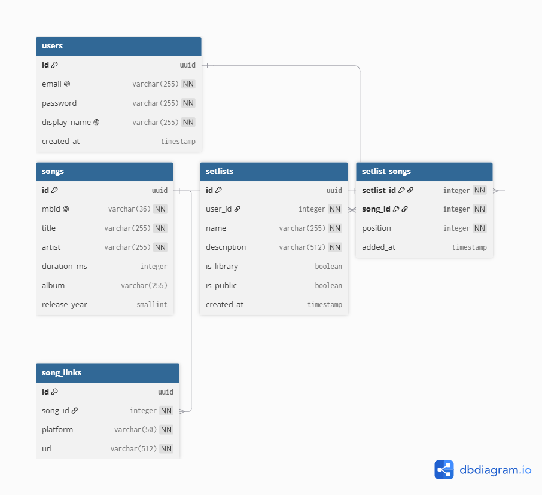

# My Setlists

## Setup

1. Clone the repository
2. Create and activate a Python virtual environment
   ```bash
   python3 -m venv .venv
   source .venv/bin/activate
   ```
3. Install dependencies:
   ```bash
   pip install -r requirements.txt
   ```
4. Copy the example environment file and fill in the database credentials:
   ```bash
   cp .env.example .env
   ```

## Running the application

Start the database and other services with Docker Compose:
```bash
docker compose up
```

Then run the FastAPI app in a separate terminal:
```bash
python main.py
```

## Database Schema

The database schema is shown below. The diagram was generated with dbdiagram.io:

- Diagram link: https://dbdiagram.io/d/MySetlists-6a3969b39340ecc065ef0adf

