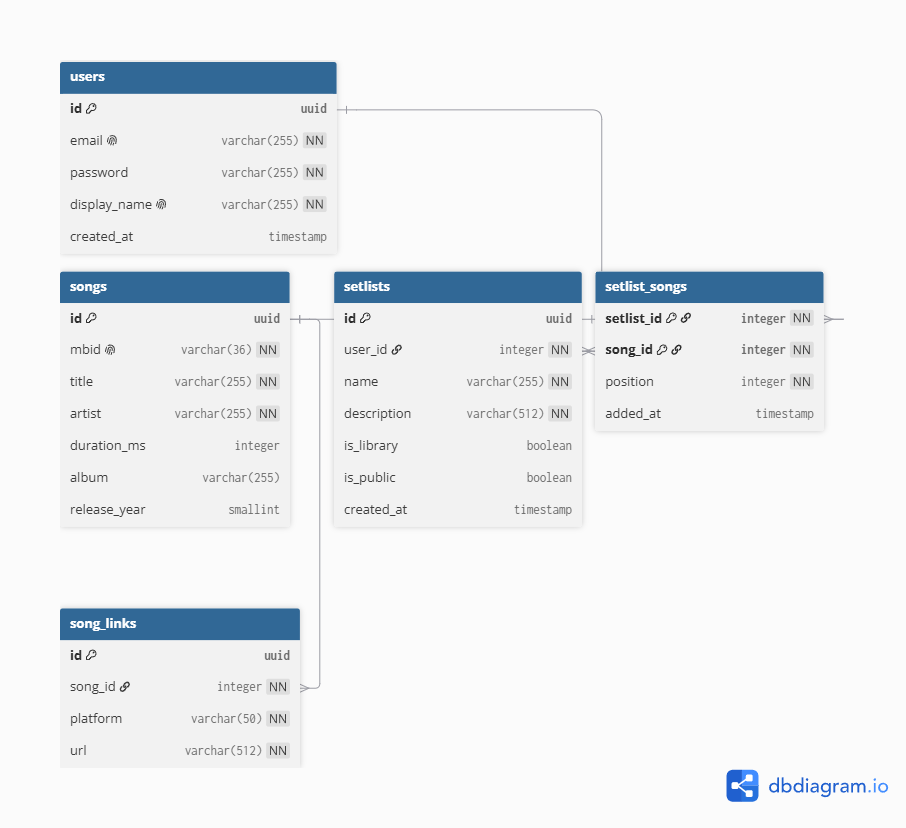

# My Setlists

## Setup

1. Clone the repository
2. Create and activate a Python virtual environment
   ```bash
   python3 -m venv .venv
   source .venv/bin/activate
   ```
3. Install dependencies:
   ```bash
   pip install -r requirements.txt
   ```
4. Copy the example environment file:
   ```bash
   cp .env.example .env
   ```
   Its `DATABASE_URL` already matches `docker-compose.yml`'s default Postgres
   credentials, so no edits are needed for local dev — except `ENVIRONMENT`,
   which ships set to `test` (in-memory SQLite, no Postgres needed) rather
   than `development`. Change it if you want `python main.py` to actually
   talk to Postgres.

## Running the application

Start the database and other services with Docker Compose:
```bash
docker compose up
```

Apply database migrations (see [migrations/README](migrations/README)):
```bash
alembic upgrade head
```

Then run the FastAPI app in a separate terminal:
```bash
python main.py
```

The app does not create tables on startup — `alembic upgrade head` is
required after a fresh checkout and after pulling changes that add a
migration.

## Testing

Run the test suite:
```bash
python -m pytest tests/ -v
```

Run a specific test file or test:
```bash
python -m pytest tests/routers/test_auth.py -v
python -m pytest tests/models/test_setlist.py::test_name -v
```

Tests are split into `tests/models/` (direct DB/model behaviour), `tests/tasks/`
(background jobs), `tests/core/` (config/settings), and `tests/routers/` (endpoint
behaviour, including middleware like CORS and rate limiting, via `TestClient`).
`tests/conftest.py` forces `ENVIRONMENT=test`, so every run uses a fresh in-memory
SQLite database and no external services are needed.

## Architecture

### Database Relationships & Cascade Delete

The application uses SQLAlchemy 2.0's cascade delete functionality to automatically clean up related records:

- **User → Setlists**: When a user is deleted, all their setlists are automatically deleted
- **Setlist → SetlistEntries**: When a setlist is deleted, all song entries are automatically removed
- **Song → SetlistEntries**: When a song is deleted, all its entries across setlists are cleaned up

This eliminates the need for manual cascading deletes in route handlers.

### Model layout & type safety

Each file in `src/models/` holds one entity's SQLModel table class together with its
API schemas (`*Create`, `*Read`, `*Update`, `*ReadWith*`). Relationships use `Mapped`
annotations from SQLAlchemy 2.0. Primary keys are `UUID`.

```python
from typing import Optional, TYPE_CHECKING
from uuid import UUID, uuid4
from sqlalchemy.orm import Mapped
from sqlmodel import Field, SQLModel, Relationship

if TYPE_CHECKING:
    from src.models.user import User

class Setlist(SQLModel, table=True):
    id: UUID = Field(default_factory=uuid4, primary_key=True)
    user_id: UUID = Field(foreign_key="users.id", ondelete="CASCADE")
    user: Mapped[Optional["User"]] = Relationship(back_populates="setlists")
```

Key patterns:
- **Forward references** use `Optional["ClassName"]` (not `"ClassName" | None`) to work with `Mapped` types
- Cross-model schema references are imported both at module top level (so SQLAlchemy can
  resolve relationship strings) and again under `TYPE_CHECKING` for annotations
- `src/models/__init__.py` imports every table model so all tables are registered on
  `SQLModel.metadata`, which the ORM and Alembic autogenerate both rely on (the app
  itself no longer creates tables — migrations do)
- **Cascade configuration** is defined via `sa_relationship_kwargs` on relationship fields

### Discogs track matching

Discogs' search API only matches at the release/master (album) level —
searching "Darkside Heart" would otherwise return the "Psychic" album, not
the "Heart" track on it. `src/services/discogs.py`'s `search_discogs()`
works around this:

1. Search masters (albums) as normal, taking the top `CANDIDATE_MASTERS` (8)
   results.
2. Fetch each candidate's full tracklist concurrently (`ThreadPoolExecutor`)
   — this keeps total latency close to that of the slowest single request
   (~1s) instead of the sum of eight sequential ones (~4-5s).
3. Score every track against the query with an F1-style word-overlap metric
   over the track's title + artist (`precision = matched / candidate_words`,
   `recall = matched / query_words`). Plain character-sequence similarity
   (`difflib.SequenceMatcher`) was tried first and rejected — it penalizes
   word reordering so heavily that "Zombie Cranberries" ranked an unrelated
   Cranberries track above the actual "Zombie".
4. Return the top-scoring tracks across all candidate masters.

A failed tracklist fetch for one candidate doesn't fail the whole search —
that master is just skipped in favour of the others. See
`tests/services/test_discogs.py` for the cases this covers.

## Database Schema

The database schema is shown below. The diagram was generated with dbdiagram.io:

- Diagram link: https://dbdiagram.io/d/MySetlists-6a3969b39340ecc065ef0adf

